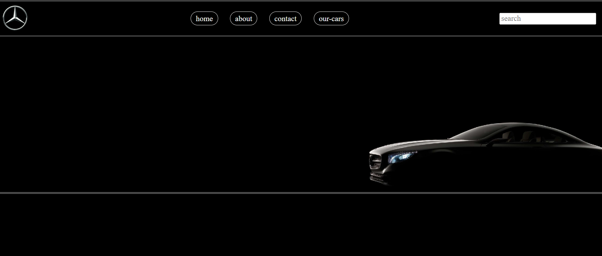
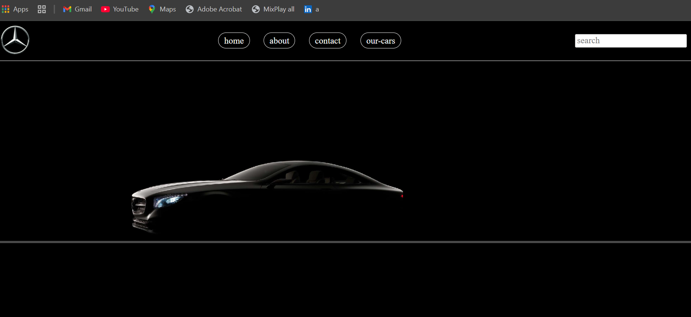

# Mercedes Website 

A sleek, responsive website for Mercedes cars built with HTML, CSS, JavaScript, and jQuery. This project showcases Mercedes car models, features, and provides a modern landing page design.

## About
This project is a simple but elegant website for Mercedes cars, including:

- Hero section with featured Mercedes models
- Car gallery with images, specifications, and smooth hover effects
- Interactive elements powered by jQuery
- Responsive layout for mobile, tablet, and desktop
- Modern UI design using CSS and animations

This project is ideal for learning **HTML, CSS, JavaScript, and jQuery**, while practicing building interactive and visually appealing websites.

## Screenshots
Here are some screenshots of the Mercedes website:




> Make sure the screenshots exist in the `Screenshot` folder and filenames match exactly.

## Technologies Used
- HTML5
- CSS3
- JavaScript (Vanilla)
- jQuery

## How to Run
1. Clone the repository:
   ```bash
   git clone https://github.com/ibrahimsome20/mercides.git
